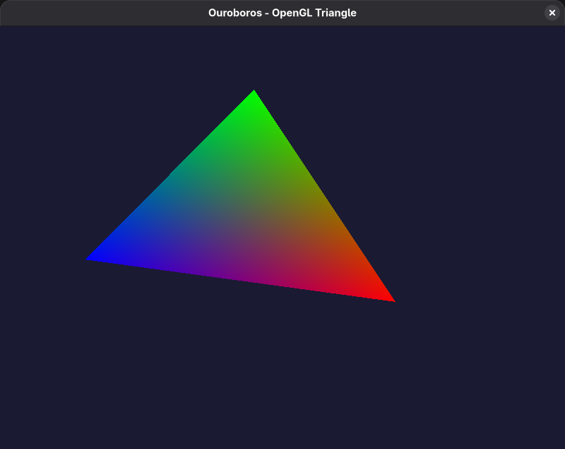

# Ouroboros

Cross-platform windowing application demonstrator built with Zig 0.12.1 and SDL2 (compiled from source via git submodule).



## System Requirements

Specific version requirements for build tools include:

* Zig == 0.12.1

* CMake >= 3.28 (for invocation of SDL builds) and associated toolchains (e.g., C/C++ compiler & libraries)

SDL2 is referenced via git submodule and built from source, but may require a minimum set of system-specific platform dependencies:

* *LINUX*: `X11-devel`, `Xext-devel`, `Xcursor-devel`, `Xinerama-devel`, `Xi-devel`, `Xrandr-devel`, `XScrnSaver-devel`, `Xxf86vm-devel`, `mesa-libGL-devel`, `mesa-libGLU-devel` (debian and arch packages may have slightly different names; when installed via system package manager, `lib` prefix will often be needed)

* *MACOS*: `xcode-select --all` can be used to install relevant development libraries

* *WINDOWS*: Existing system APIs should be sufficient

## Building and Testing

First, once this project has been cloned, ensure the submodules are correctly initiated:

```bash
git submodule update --init
```

You should then be able to build (including the SDL2 library) from source:

```bash
zig build
```

You can launch the test program, which will now present the traditional OpenGL "spinning rainbow triangle" demonstration:

```bash
zig build run
```

## Visions and Dependencies

Right now we're learning via Cursor so a lot of this is constrained to (most recently) 0.12.1; this will change as I learn more and as newer models are released.

A [TASKS.md](TASKS.md) outlines work done, near-term plans/tasks, and long-term backlog/vision (as well as Cursor/Claude management).

In addition to SDL, we have also added a `zlm` dependency to prepare for a more numerically-intensive future. Right now this has a super-basic alternative build to hook in the submodule (it's a single source file) from a forked version of <ziglibs/zlm> tweaked to ensure 0.12.1 compatibility.

This application also makes a good "jumping off" point for those wishing to do some OpenGL work in a nicely-predefined Linux-first Zig environment. For example, you could clone this and get right into [Learn OpenGL](https://learnopengl.com/Getting-started/Hello-Triangle).

I'm not in love with the way we're redefining OpenGL types, constants, and function pointers in `src/gl.zig`; there's probably a better approach here but it might also be moot once we migrate to WebGPU. In the meantime, we'll add/extend as needed.
